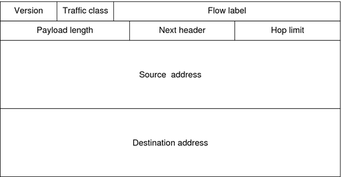

# Sistemi Appunti IPv6

# Indice

- [1. Limitazioni IPv4](#1-limitazioni-ipv4)
- [2. Introduzione](#2-introduzione)
- [3. Vantaggi](#3-vantaggi)
- [4. Header IPv6 (4x40 byte)](#4-header-ipv6--4x40-byte-)
  * 4.1. Campi dell’Header
  * 4.2. Vantaggi dell’Header
- [5. Coesistenza tra IPv4 e IPv6](#5-coesistenza-tra-ipv4-e-ipv6)
- [6. Rappresentazione degli Indirizzi IPv6](#6-rappresentazione-degli-indirizzi-ipv6)
  * 6.1. Formato Predefinito
  * 6.2. Formato Abbreviato
    + 6.2.1. Omettere gli zeri
    + 6.2.2. Utilizzo dei due punti doppi
- [7. Prefisso](#7-prefisso)
- [8. Tipi di Indirizzi IPv6](#8-tipi-di-indirizzi-ipv6)
  * 8.1. Unicast
    + 8.1.1. Unicast Globale (GUA)
      + 8.1.1.1. Struttura
    + 8.1.2. Link-Local (FE80::/10)
    + 8.1.3. Unique local (FC00::/7)
  * 8.2. Multicast
  * 8.3. Anycast
- [9. Tipi di Configurazione](#9-tipi-di-configurazione)
  * 9.1. **Opzione 1 RA:** solo SLAAC
    + 9.1.1. Generazione dell’ID Interfaccia
  * 9.2. **Opzione 2 RA: SLAAC e DHCPv6 stateless**
  * 9.3. **Opzione 3 RA: DHCPv6 stateful**

# 1. Limitazioni IPv4

- Esaurimento degli indirizzi IP
- Espansione della tabella di routing Internet
- Mancanza di connettività end-to-end (NAT)

# 2. Introduzione

L’IETF (Internet Engineering Task Force) negli anni ‘90 inizia a formulare il protocollo IPv6.

# 3. Vantaggi

| Spazio degli Indirizzi Aumentato | 32bit → 128bit (4.294.967.296 → 340.282.366.920.938.463.463.374.607.431.768.211.456) |
| --- | --- |
| Gestione dei Pacchetti migliorata | header semplificato e con un numero ridotto di campi |
| Elimina il NAT (Network Address Translation) | Non più necessario tra indirizzi pubblici e privati |

# 4. Header IPv6 (4x40 byte)

## 4.1. Campi dell’Header

| Nome | Lunghezza | Descrizione |
| --- | --- | --- |
| Version | 4 bit | Contiene un valore impostato a 0110, ovvero 6, che indica la versione del protocollo. |
| Traffic Class | 8 bit | Equivale al campo Type of Service di IPv4, contiene dati aggiuntivi per aggiungere funzionalità. |
| Flow Label | 20 bit | Tutti i pacchetti con la stesso valore in questo campo ricevono la stessa gestione dal router. |
| Payload Length | 16 bit | Indica la lunghezza del payload. |
| Next Header | 8 bit | Equivale al campo Protocol dell’IPv4, contiene l’identificativo del protocollo trasportato. |
| Hop Limit | 8 bit | Equivale al campo TTL dell’IPv4, indica dopo quanti router il pacchetto deve essere cassato. Il router decrementa questo campo di uno. Quando il campo raggiunge lo 0, il pacchetto viene cassato e un pacchetto ICMPv6 di tempo scaduto viene inoltrato all’host di invio. |
| Source IPv6 Address | 128 bit | IPv6 dell’host mittente. |
| Destination IPv6 Address | 128 bit | IPv6 dell’host destinatario. |
| Header di Estensione (EH) | - | Sono posizionati tra l'header IPv6 e il carico utile. Vengono utilizzati per la frammentazione, la sicurezza, ecc. |

<aside>
💡 A differenza dei pacchetti IPv4, i router non frammentano i pacchetti IPv6.

</aside>

## 4.2. Vantaggi dell’Header

- Formato dell’header semplificato, per una gestione efficente dei pacchetti
- Maggiore carico utile per supportare un troughput e un’efficenza di trasporto più elevati
- Architettura gerarchica mirata all’efficenza del routing
- Configurazione automatica degli indirizzi

# 5. Coesistenza tra IPv4 e IPv6

VIsto che non è stata disposta una data precisa per la transizione ad IPv6, per ora i due protocolli dovranno convivere. Sono state proposte diverse soluzioni:

| Dual Stack | Il dispositivo esegue contemporaneamente gli stack dei protocolli IPv4 e IPv6. |
| --- | --- |
| Tunneling | Il pacchetto IPv6 viene incapsulato in un pacchetto IPv4, per passare in reti che supportano solo quest’ultimo. |
| Traduzione | Pacchetti vengono tradotti da IPv6 a IPv4 e viceversa tramite NAT 64 (Network Address Translation 64), utilizzando una tecnica simile a NAT per IPv4. |

<aside>
💡 Tunneling e Traduzione sono utilizzati solo dove strettamente necessario. L’obbiettivo sarebbe avere una comunicazione IPv6 dall’inizio alla fine.

</aside>

# 6. Rappresentazione degli Indirizzi IPv6

Gli indirizzi IPv6 hanno una lunghezza di 128 bit e sono scritti sotto forma di stringa in valori esadecimali. Ogni gruppo di 4 bit è rappresentato con una singola cifra esadecimale, e ongi gruppo di 4 valori esadecimali rappresenta un hextetto. 8 hextetti separati da due punti rappresentano un indirizzo IPv6.

## 6.1. Formato Predefinito

Tutte le 32 cifre esadecimali sono scritte.

> Esempio: **2001:0db8:85a3:0000:0000:8a2e:0370:7334**
> 

## 6.2. Formato Abbreviato

Ecco i passaggi per trasformare un indirizzo in formato abbreviato.

### 6.2.1. Omettere gli zeri

Si omettono gli 0 non significativi.

> Esempio: **2001:db8:85a3:0:0:8a2e:0370:7334**
> 

### 6.2.2. Utilizzo dei due punti doppi

Si sostituisce la serie di hextetti a 0 più lunga con due doppi punti.

> Esempio: **2001:db8:85a3::8a2e:0370:7334**
> 

# 7. Prefisso

E’ il corrispondente della subnetmask nell’IPv4. Non ha una notazione decimale puntata, bensì solo la slash notation. Viene infatti indicato con **indirizzo IPv6**/**lunghezza del prefisso**.

Una lunghezza tipica del prefisso IPv6 per LAN e la maggior parte degli altri tipi di reti è /64. Ci stanno quindi 64 bit che indicheranno la porzione di rete e altri 64 bit la porzione host, che sta ad indicare l’**ID interfaccia**.

# 8. Tipi di Indirizzi IPv6

<aside>
💡 Indirizzi IPv6 Particolari:

| Loopback | ::1/128 |
| --- | --- |
| Indirizzo non specificato | ::/128 |
</aside>

## 8.1. Unicast

Indirizzo che indentifica in modo univoco un’interfaccia su un dispositivo abilitato per IPv6.

<aside>
💡 Un indirizzo IPv6 mittente deve essere **Unicast**.

</aside>

### 8.1.1. Unicast Globale (GUA)

Global Unicast Address. Simile ad un indirizzo IPv4 pubblico, è un indirizzo univoco a livello globale, instradabile su Internet.

Possono essere configurati in modo statico o assegnati in modo dinamico. Attualmente, vengono assegnati solo indirizzi unicast globali con i primi tre bit corrispondenti a 001 (o 2000::/3).

### 8.1.1.1. Struttura

| Prefisso di routing globale | ID subnet | ID interfaccia |
| --- | --- | --- |
- **Prefisso di routing globale**: porzione di prefisso (o di rete) assegnato dal provider (es. ISP), a un cliente (o a un sito). Il prefisso è in genere /48.

> Esempio: **22001:0DB8:ACAD::/48**
> 
- **ID subnet**: è utilizzato da un'azienda per identificare le subnet all'interno del proprio sito. Quanto più grande è l'ID subnet, tante più subnet sono disponibili.
- **ID interfaccia**: identificativo dell’interfaccia. Si consiglia vivamente di usare il prefisso /64, quindi un interfaccia a 64 bit.

<aside>
💡 In IPv6 è possibile assegnare a un dispositivo indirizzi degli host composti solo da 0 o da 1. Gli indirizzi di broadcast non vengono impiegati all'interno di IPv6, e l'indirizzo di soli zeri  è riservato come indirizzo anycast subnet-router e deve essere assegnato solo a router.

</aside>

### 8.1.2. Link-Local (FE80::/10)

Utilizzati spesso per comunicare con dispositivi nello stesso link locale. Con IPv6, il termine link si riferisce ad una subnet.

Questi indirizzi devono essere quindi univoci all’interno di questo link e non sono instradabili oltre.

Possono essere generati randomicamente o tramite Processo EUI-64 a partire dal prefisso FE80::/10, o possono essere impostati staticamente.

<aside>
💡 Un router non inoltra pacchetti con indirizzo link-local di origine o di destinazione.

</aside>

<aside>
💡 Ogni interfaccia di rete abilitata per IPv6 deve disporre di almeno un indirizzo link-local; l’indirizo unicast globale non è un requisito. Se l’interfaccia non ne dispone, tramite un server DHCP il dispositivo lo avrà assegnato dinamicamente.

</aside>

### 8.1.3. Unique local (FC00::/7)

Questi indirizzi vengono utilizzato per l’indirizzamento locale all’interno di un sito o entro un numero limitato di siti. Non sono instradabili e non sono traducibili a IPv6 globale.

## 8.2. Multicast

Viene utilizzato per inviare un singolo pacchetto a diverse destinazioni.

## 8.3. Anycast

Indirizzo unicast che può essere assegnato a più dispositivi. Verrà instradato al dispositivo più vicino con quell’indirizzo.

# 9. Tipi di Configurazione

Stateless Address Autoconfiguration (SLAAC) è un metodo che consente a un dispositivo di ottenere il prefisso, la lunghezza del prefisso, l'indirizzo del gateway predefinito e altre informazioni da un router IPv6 senza l'utilizzo di un server DHCPv6. Con SLAAC, i dispositivi si affidano ai messaggi Router Advertisement (RA) ICMPv6 del router locale per ottenere le informazioni necessarie.

Ogni 200 secondi i router IPv6 inviano periodicamente messaggi RA ICMPv6 a tutti i dispositivi abilitati per IPv6 della rete. Un messaggio RA viene inviato anche in risposta a un host che invia un messaggio Router Solicitation (RS) ICMPv6.

Il messaggio RA ICMPv6 è un suggerimento dato a un dispositivo su come ottenere un indirizzo IPv6 unicast globale. L'ultima decisione spetta al sistema operativo del dispositivo. Il messaggio RA ICMPv6 include:

- **Prefisso di rete e lunghezza del prefisso**: indica al dispositivo la rete a cui appartiene.
- **Indirizzo gateway predefinito**: è un indirizzo IPv6 link-local, l'indirizzo IPv6 di origine del messaggio RA.
- **Indirizzi DNS e nome del dominio**: indirizzi di server DNS e un nome del dominio.

## 9.1. **Opzione 1 RA:** solo SLAAC

Per impostazione predefinita, il messaggio RA suggerisce che il dispositivo ricevente utilizzi le informazioni contenute nel messaggio RA per creare il proprio indirizzo IPv6 unicast globale e per tutte le altre informazioni. I servizi di un server DHCPv6 non sono necessari.

SLAAC è stateless, il che significa che non è presente un server centrale (ad esempio, un server DHCPv6 stateful) che assegna indirizzi unicast globali e conserva un elenco dei dispositivi e dei relativi indirizzi. Con SLAAC, il dispositivo client utilizza le informazioni contenute nel messaggio RA per creare il proprio indirizzo unicast globale. Come mostrato nella Figura 2, le due parti dell'indirizzo vengono create nel seguente modo:

- **Prefisso**: ricevuto nel messaggio RA
- **ID interfaccia**: utilizza il processo EUI-64 o viene generato un numero casuale a 64 bit

<aside>
💡 Per impostazione predefinita, il messaggio RA corrisponde all'opzione 1, solo SLAAC. L'interfaccia del router può essere configurata in modo che invii un annuncio router utilizzando SLAAC e DHCPv6 stateless o solo DHCPv6 stateful.

</aside>

## 9.1.1. Generazione dell’ID Interfaccia

L’ID di interfaccia può essere o generato casualmente o tramite Processo **EUI-64**. Il processo parte dal MAC Address dell’interfaccia di rete: 

| Organizationally Unique Identifier (OUI) | Identificativo dispositivo |
| --- | --- |
| L'OUI è un codice produttore a 24 bit (6 cifre esadecimali) assegnato da IEEE. | L'identificativo dispositivo è un valore univoco a 24 bit (6 cifre esadecimali) all'interno di un OUI comune. |

Si eseguono poi le seguenti fasi:

| Fase 1 | Dividere l'indirizzo MAC tra l'OUI e l'identificativo del dispositivo. |
| --- | --- |
| Fase 2 | Inserire il valore esadecimale FFFE, che in numerazione binaria è: 1111 1111 1111 1110. |
| Fase 3 | Convertire i primi 2 valori esadecimali dell'OUI in numerazione binaria e invertire il bit U/L (Universally/Locally, 7° bit). |

L’ID Interfaccia è quindi composto da:

| 24 bit | 16 bit | 24 bit |
| --- | --- | --- |
| OUI a 24 bit dell'indirizzo MAC del client, ma il bit U/L  è invertito.
 | Il valore FFFE a 16 bit inserito.
 | L'identificativo del dispositivo a 24 bit, proveniente dall'indirizzo MAC del client. |

<aside>
💡 Nella generazione casuale dell’ID Interfaccia, per garantire l'univocità degli indirizzi IPv6 unicast, il client può utilizzare un processo noto come rilevamento degli indirizzi duplicati (DAD). Questo assomiglia a una richiesta ARP del proprio indirizzo. Se non arriva una risposta, l'indirizzo è univoco.

</aside>

## 9.2. **Opzione 2 RA: SLAAC e DHCPv6 stateless**

Con questa opzione, il messaggio RA suggerisce che i dispositivi utilizzino:

- SLAAC per creare il proprio indirizzo IPv6 unicast globale.
- L'indirizzo link-local del router, l'indirizzo IPv6 di origine RA per l'indirizzo del gateway predefinito.
- Un server DHCPv6 stateless per ottenere altre informazioni, ad esempio un indirizzo del server DNS e un nome del dominio.

<aside>
💡 Un server DHCPv6 stateless distribuisce indirizzi del server DNS e nomi di dominio. Non assegna indirizzi unicast globali.

</aside>

## 9.3. **Opzione 3 RA: DHCPv6 stateful**

Il metodo DHCPv6 stateful è simile a DHCP per IPv4. Un dispositivo può ricevere automaticamente informazioni di indirizzamento, tra cui un indirizzo unicast globale, la lunghezza del prefisso e gli indirizzi dei server DNS utilizzando i servizi di un server DHCPv6 stateful.

Con questa opzione, il messaggio RA suggerisce che i dispositivi utilizzino:

- L'indirizzo link-local del router, l'indirizzo IPv6 di origine RA per l'indirizzo del gateway predefinito.
- Un server DHCPv6 stateful per ottenere un indirizzo unicast globale, l'indirizzo del server DNS, il nome del dominio e tutte le altre informazioni.

Un server DHCPv6 stateful assegna e conserva un elenco che indica la corrispondenza tra i dispositivi e gli indirizzi IPv6 ricevuti. DHCP per IPv4 è stateful.

<aside>
💡 L'indirizzo del gateway predefinito può essere ottenuto solo dinamicamente dal messaggio RA. Il server DHCPv6 stateless o stateful non fornisce l'indirizzo del gateway predefinito.

</aside>
